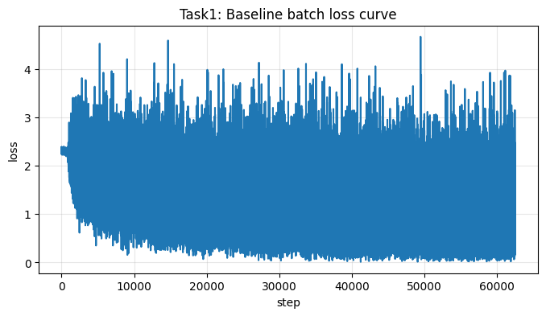
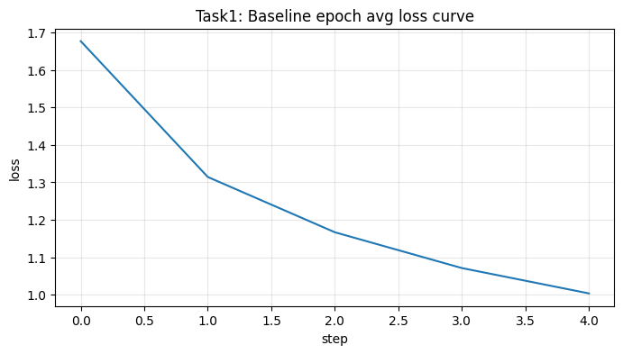

# CIFAR-10 图像分类实验报告

## 摘要（Abstract）
本实验在 CIFAR-10 数据集上完成了 4 个任务：损失曲线可视化、加入正则化、学习率对比和自定义网络。实验结果表明，学习率会明显影响收敛速度和准确率；在本次参数下，Task2 的正则化结果低于基础模型；自定义网络准确率最高。

## 引言（Introduction）
这次作业的目标是用深度学习方法做一个 10 分类图像识别任务，并了解模型训练和测试的基本流程。

我先复现了给出的基础 LeNet 网络，然后按任务要求依次完成了损失可视化、加入正则化、调整学习率和设计新网络。

通过这些实验，我重点观察训练损失和测试准确率，并用图表整理了每组结果。

## 方法（Methodology）
1. **数据集与预处理**：使用 CIFAR-10，图像转为张量并做归一化。
2. **基础模型**：使用 LeNet（2个卷积层+3个全连接层），损失函数为交叉熵，优化器为 SGD。
3. **Task1**：在训练中记录每个 batch 的 loss，并画出损失曲线。
4. **Task2**：在第一个全连接层和第二个全连接层之间加入 Dropout（p=0.3），并在优化器加入 L2 正则（weight_decay=1e-4）。
   - **L2 正则化原理**：在损失中加入参数平方和惩罚项，抑制权重过大，降低过拟合风险。
   - **Dropout 原理**：训练时随机“失活”一部分神经元，减少神经元之间过度依赖，提高泛化能力。
5. **Task3**：对比不同学习率（0.0005、0.001、0.005）的训练结果。
6. **Task4**：实现一个更现代的 CNN（更多卷积层，含 BatchNorm 和 Dropout），并和基础模型比较。

## 实验（Experiments）
### 1）实验设置
- 框架：PyTorch
- 训练轮数：基础实验 5 个 epoch（Task3 为 3 个 epoch 对比）
- 结果指标：测试集准确率（Accuracy）和训练损失（Loss）

### 2）实验结果与分析
**（1）Task1：损失函数变化图（图）**

图1、图2都显示训练过程中 loss 总体下降，说明模型在学习。  
对“训练集上的损失越小，模型效果越好吗？”这个问题，我的结论是：**不一定**。训练损失变小只说明对训练集拟合更好，最终还要看测试集准确率，避免过拟合。

**（2）各任务主要结果（表）**

| 任务 | 主要设置 | 最终平均loss | 测试准确率 |
|---|---|---:|---:|
| Task1（基础LeNet） | SGD, lr=0.001, epoch=5 | 1.004（第5轮） | 60.85% |
| Task2（Dropout+L2） | Dropout p=0.3, weight_decay=1e-4 | 1.229（第5轮） | 57.58% |
| Task3（lr=0.0005） | SGD, epoch=3 | 1.2835 | 55.71% |
| Task3（lr=0.001） | SGD, epoch=3 | 1.1997 | 58.49% |
| Task3（lr=0.005） | SGD, epoch=3 | 1.6175 | 44.11% |
| Task4（自定义CNN） | Adam, lr=0.001, epoch=5 | 0.839（第5轮） | 68.32% |

**（3）Task3 参数变化分析**

- 当学习率从 0.0005 增大到 0.001 时，收敛更快，准确率提升（55.71% → 58.49%）。
- 当学习率继续增大到 0.005 时，loss 反而变大，准确率明显下降到 44.11%，说明学习率过大导致训练不稳定。
- 所以在本实验中，**0.001 是更合适的学习率**。

**（4）Task4 与基础网络对比**

Task4 自定义网络准确率 68.32%，高于基础 LeNet 的 60.85%。  
说明更深一些、带 BatchNorm/Dropout 的网络在 CIFAR-10 上有更好表现，但训练开销也更大。

## 总结（Conclusion）
本实验完成了作业要求的四个任务，并用图和表整理了结果。实验说明：学习率会明显影响训练效果；Task2 中两种正则化方法已实现，但本次参数下准确率未超过基础模型；自定义网络取得了最高准确率。
